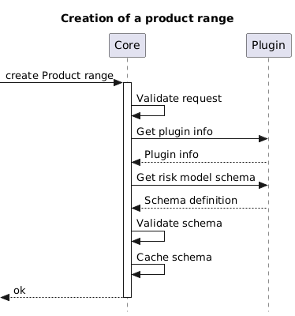

# SoFIE - Plugin Development V1
## Guide & API Documentation

| Version | Author                             | Comment |
|---------|------------------------------------|----|
| 0.1     | Daan Kets                          | Initial version |
| 0.2     | Lobke Mertens                      | Review |
| 1.0     | Nikolay   Ivanov   & Lobke Mertens | Updating documentation |
| 1.1     |  Nikolay   Ivanov                      | Clarifying parts |

# Introduction

This document provides an overview of what SoFIE **plugins** are, how
they integrate with the Core SoFIE platform, and how to develop them.
The document will provide API documentation as well as practical and
performance guidelines.

This document is maintained separately from the API's and code base, and
certain API updates may not be immediately reflected in this document.

# Content

[1.Introduction](#introduction)

[2.Content](#content)

[3.Some conventions](#some-conventions)
- [HTTP methods used](#http-methods-used)
- [HTTP Response Codes Returned](#http-response-codes-returned)
- [HTTPS/HSTS](#httpshsts)
- [CORS](#cors)
- [HTTP Authentication](#http-authentication)
- [Number formats](#number-formats)
- [JSON payloads](#json-payloads)
- [File uploads](#file-uploads)
- [Pass-through Authentication](#pass-through-authentication)

[4.What is a SoFIE Plugin?](#what-is-a-sofie-plugin)

[5.Risk model?](#risk-model)
- [Definition](#definition)
- [How is a risk model defined?](#how-is-a-risk-model-defined)
- [Retrieving a risk model schema](#_heading=h.3ygebqi)
  - [SoFIE Core Types](#_heading=h.2dlolyb)
- [Creating a newly initialized risk model (retrieving a risk template)](#creating-a-newly-initialized-risk-model-retrieving-a-risk-template)
- [Validating a risk model](#validating-a-risk-model)
- [Generation of custom premiums](#generation-of-custom-premiums)
- [How does it work](#how-does-it-work)
- [Tags](#tags)
- [Risk model status](#risk-model-status)
- [Rate calculation](#rate-calculation)
- [Retrieve supported rate methods](#retrieve-supported-rate-methods)
- [Invoking rate calculation for a rate method](#invoking-rate-calculation-for-a-rate-method)
  - [Important](#important)
  - [Rate components](#rate-components)

[6.Broker and product configuration](#broker-and-product-configuration)
- [Best practices](#best-practices)
  - [Broker](#broker)
  - [Product](#product)
- [Retrieval of configuration](#retrieval-of-configuration)

[7.Temporal reference data](#temporal-reference-data)
- [Best practice](#best-practice)

# Some conventions

## HTTP methods used

-   **POST** is used for creation, modification, and performing actions.
    The post bodies (if applicable) are always validated before any
    action is undertaken.

-   **PUT** is used for saving data, and will return the exact copy of
    the saved date if successful

-   **GET** is used for retrieving data

-   **PATCH** is used for updating fields within a model, a copy of the
    updated model will be returned

-   **DELETE** is used for deleting a model instance. No content will be
    returned.

## HTTP Response Codes Returned

-   **200 OK** - Request processed as expected

-   **201 CREATED** - Request processed and data created

-   **202 ACCEPTED** - The request has been accepted and will be
    processed in due time asynchronously. No response body is provided.

-   **203 NON AUTHORITATIVE** - A proxy modified the content of the
    response (not raised by our APIs)

-   **204 NO CONTENT** - The item was deleted successfully

-   **205 RESET CONTENT** - The UI should reset the form submitted

-   **206 PARTIAL CONTENT** - The item is sent in parts, and the body is
    only a partial response

-   **400 CLIENT ERROR** - Any client error without a specific

-   **401 UNAUTHENTICATED** - The API key or other credentials provided
    were invalid or missing

-   **403 UNAUTHORIZED** - The authenticated principal does not have
    permission to execute the requested use case

-   **404 NOT FOUND** - The requested resource could not be found (and
    was not soft-deleted)

-   **405 METHOD NOT ALLOWED** - The requested method is not available
    on the provided URI

-   **409 CONFLICT** - The requested use case cannot be executed as it
    conflicts with the current state

-   **410 GONE** - The item was previously (soft) deleted (we still know
    it used to exist)

-   **412 PRECONDITION FAILED** - The request could not be executed due
    to a precondition that could not be satisfied

-   **500 INTERNAL SERVER ERROR** - An unexpected exception occurred

-   **501 NOT IMPLEMENTED** - The requested method is not yet available
    in this release

-   **502 BAD GATEWAY** - The API gateway received an invalid upstream
    response

-   **503 SERVICE UNAVAILABLE** - The requested service is temporarily
    unavailable to the API gateway

-   **504 GATEWAY TIMEOUT** - The upstream service did not respond to
    the request in time

## HTTPS/HSTS

-   All our APIs and frontends are only available via HTTPS. We use
    <u>[HSTS](https://en.wikipedia.org/wiki/HTTP_Strict_Transport_Security)</u>
    in order to enforce this.

-   We do not accept certain insecure cyphers. We do not make
    exceptions.

-   We require the use of SNI for the selection of correct certificates
    on our load balancers. We can provide a specific endpoint that does
    not require SNI upon request, at the monthly cost of the static IP
    address.

## CORS

We require the use of
<u>[CORS](https://developer.mozilla.org/en-US/docs/Web/HTTP/CORS)</u>
headers for interactive (browser) APIs. We do NOT support wildcards.

## HTTP Authentication

We use the HTTP Authorization header and a <u>[Bearer
token](https://swagger.io/docs/specification/authentication/bearer-authentication/)</u>
for authentication. The bearer token can either be an API key,
associated with a specific IP origin known to our API gateway, or a user
authentication token received from the login endpoint, associated with
the IP address at the time of login (limited lifetime).

*We expect to switch to a new way of authentication and authorization in
the near future. The most likely candidate is the use of <u>[JSON Web
Tokens](https://jwt.io/)</u>.*

## Number formats

The application does avoid the use of floating point numbers in transit
and in storage. Therefore, almost all numerical values are restricted to
64bit integral values. In many cases, the final 2 characters are 2 fixed
decimals. We also use a fixed-precision type called "Numerical", which
consists of 2 integral values:

A value and the number of decimals. In such a case, a `{value :321 and
decimals: 1}` would mean 32,1 fixed.

The number of decimals cannot be negative, but the value may have less
characters than the number of decimals: `{value: 1, decimals: 2}` means:
0,01 fixed.

Optionally, a symbol may be provided: `{value: 100, decimals: 2, symbol:
\"€\"}`: 1,00 €.

## JSON payloads

Examples that represent a JSON request or response payload are displayed
in 'JavaScript' style, without quotation marks surrounding the property
names except when a non-name character is used. This is done for
readability purposes, and to avoid confusion with string values. When
submitting JSON data to our APIs however, the property names must be
properly quoted.

While example payloads are most often displayed in a formatted way, we
accept and promote the use of unformatted, minimal JSON payloads. Our
APIs will return unformatted JSON.

Most of our API's are explicitly strict (unless explicitly mentioned),
and will therefore refuse any unexpected properties within a JSON
payload.

## File uploads

For compatibility and security reasons, our APIs only accept file
uploads when:

-   base64 encoded

-   not larger than the maximum payload size as configured

-   the correct content-length is provided

-   the content-type matches a permitted content type

-   the content does not trigger certain checks (executables etc)

## Pass-through Authentication

For some requests to the SoFIE core (such as retrieving broker or
product configuration), plugins need to use pass-through authentication
for accessing methods of the core. This means that the following steps
need to occur:

1.  The core makes a request to an API of the plugin

2.  The core provides a <u>[bearer
    token](https://datatracker.ietf.org/doc/html/rfc6750)</u>
    within the **Authorization** header, which ensures that the plugin
    will allow the request

3.  The core provides the **X-RethinkIT-Request-Auth** header, which can
    in turn be used by the plugin to get access to the core <u>during the
    lifetime of the request</u>

    a.  The plugin retrieves product and broker configuration from the
        core using the specified token as the bearer token.

# What is a SoFIE Plugin?

A SoFIE plugin is a **customer specific** application module that
contains the customer specific application's logic for one or more
product ranges. The module integrates with the Core system via
OpenAPI [^1] (REST) web services, and provides the following features:

1.  Definition of the risk model **schema** for each type of product
    range

2.  Provision of a newly initialised risk model instance (a **template**
    object)

3.  **Transformation** rules that can be applied to a risk model
    instance

4.  **Validation** rules that will assert the validity of a risk model
    instance, and report inconsistencies

5.  **Insurability** status of a risk model instance

6.  **Business logic** that will determine:

    a.  Insurability

    b.  Risk level (optional)

    c.  Tags (optional)

    d.  Risk summary (optional)

7.  **Calculation logic** that will calculate rates on:

    a.  Newly created and existing contract versions during the
        execution of addenda

    b.  Existing contract versions while emitting terms (renewal or
        instalments)

8.  ***Optional* business logic** to determine the validity of a
    contract's timeline (Applying business rules to a sequence of
    contract versions)

9.  ***Optional* calculation logic** to determine any custom premiums
    (like one-time broker fees) for the timeline of a contract.

*In addition to the above, a plugin may contain extra integration logic,
use external data sources (for example calling third-party services, or
retrieving data through SoFIE API endpoints), etc.*

It is important to understand that it is the SoFIE Core that will take
initiative by making requests to the plugin, not the other way around.
This may happen in the following cases:

-   **Risk model validation & Transformation**

    -   A user is creating or editing a lead

    -   A user is creating or editing an offer

    -   A user is creating a new contract version via an addendum

-   **Risk model validation & Rate calculation (no transformation)**

    -   A user is retrieving the list of matching products for a
        specific lead

    -   An offer is being recalculated after editing

    -   A version of a contract is being recalculated upon creation via
        an addendum

    -   A version of a contract is being recalculated as part of the
        premium emission process

-   **Custom premium emission**

    -   The timeline for a new addendum is being checked for the need of
        custom premium emission.

# Risk model?

## Definition

A risk model within SoFIE is a JSON object structure that contains all
fields necessary in order to describe a unique risk - and potentially
optional packages, coverages and options. A risk model has a structure
that cannot be determined upfront by the application, and does not
follow the same release schedule as the SoFIE Core. Therefore, it is up
to the plugin to supply the format and logic of the risk model.

## How is a risk model defined?

The format and contents of a risk model is defined within a risk model
schema. The schema is a JSON document that *describes* all the different
fields that **may or must** occur in a single risk model instance. It
defines the field types, whether fields are required or not, whether
fields indicate a relationship to an entity within the core system and
much more.

Based on the risk schema definition and the defaults for the fields in
it, the core can initialize a new copy of a risk model instance, if the
plugin does not support providing a newly initialized instance.

The risk schema may also be used by the built-in rendering module in
SoFIE Dashboard. Based on the definitions, a dynamically generated UI
view is presented to the users of the platform when the risk model is
first created or edited.

Supplying the risk schema definition is the first responsibility of a
plugin. The core will request it once the plugin is added into the core,
and refresh it on a regular basis. The plugin must supply a valid schema
via the following endpoint.

    

## Retrieving a risk model schema

**Required method** for each plugin. Retrieves the schema that describes
the risk model fields.

<table style="display: flex; justify-content: center; text-align: left">
  <tr>
    <th colspan="3">Get the risk model schema (simple)</th>
  </tr>

  <tr>
    <th>METHOD</th>
    <th>URI</th>
    <th>RESPONSE</th>
  </tr>
  <tr>
    <td>GET  (-)</td>
    <td>/schema</td>
    <td>→ 200 OK
(application/json)
</td>
  </tr>

  <tr>
    <th>HEADER</th>
    <th colspan="2">VALUE</th>
  </tr>
  <tr>
    <td>Accept</td>
    <td colspan="2">application/json</td>
  </tr>
  <tr>
    <td>Accept-Encoding</td>
    <td colspan="2">UTF-8</td>
  </tr>

  <tr>
    <th colspan="3">Response body example - Schema V1</th>
  </tr>
  <tr>
    <td colspan="3">
        <pre>
{
  demoField : {
    required: true,
    label: {
      en: "English",
      nl: "Nederlands",
      fr: "Français"
    },
    type: "string",
    default: "Hello, world"
  },
  demoListField : {
    required: false,
    label: {
      en: "English 2",
      nl: "Nederlands 2",
      fr: "Français 2"
    },
    type: "string",
    subtype: "list"
    default: "no",
    options: {
      no: {
        label: {
          en: "No",
          fr: "Non",
          nl: "Nee"
        }
      },
      yes: {
        label: {
          en: "Yes",
          fr: "Oui",
          nl: "Ja"
        }
      },
    }
  }
}

</pre>
    </td>
  </tr>
</table>

The response returns a JSON object, of which each key is the name of a
field in the risk schema, and the corresponding object describes the
field's characteristics.

The following properties are supported in plugin **Schema V1**:

-   **type**\
    A **required** field that indicates the type of the property. The
    possible values are:

    -   **string**\
        A string value. Can be a foreign key. See **subtype**

    -   **Boolean**\
        A Boolean value: true or false

    -   **number**\
        A JavaScript number. An optional subtype can be provided (See
        **subtype**) in case the render engine of SoFIE is used (See
        **How is a risk model defined?**)

    -   **Date**\
        An ISO 8601 Date

    -   **numerical**\
        A fixed-precision numerical value, stored as an integral value +
        a number of decimals. For example 12345 and 3 would indicate the
        fixed-precision value 12,345.

    -   **Contact**\
        A complex object type to model "contact" details (See **SoFIE
        Core Types)**. It is possible to customize the required fields
        in the options (see **options**) object.

    -   **Address**\
        A complex object type to model "address" details (See **SoFIE
        Core Types** and **Risk Schema Integrations**).

> **NOTE: Schema V1** supports **ONLY** top-level property definitions.
> It is **NOT** allowed to have nested fields or create custom types,
> such as:
><pre>{
>    demoField: {
>        <del>nestedField: {
>            required: true,
>            label: {
>                en: "English",
>                nl: "Nederlands",
>                fr: "Français"
>            },
>            type: "string\",
>        }</del>
>    }
>}
></pre>

-   **required**\
    An optional field that indicates an (always) mandatory field.
    Defaults to false.

-   **label**\
    An optional set of labels to use for the field in multiple
    languages. An object, where the key is an iso2 language code (nl,
    be, fr).

-   **default**\
    An optional default value for the field, that is used when
    initializing a new risk model. MUST match the type of the field
    itself.

-   **subtype**\
    Indicates an additional sub-type restriction for a field. For
    example, string fields that are foreign keys to data in the core, or
    number fields that are actually currency values. Possible values
    are:

    -   **Organisation (**string**)**\
        Indicates that the potential value of a string field MUST refer
        to an Organization object from the tenant's core DB.

    -   **Partner** (string)\
        Indicates that the potential value of a MUST refer to a Partner
        object from the core. The [options.type]{.underline} field must
        define the type of the partner (a string field with a name
        value, like 'legal' or 'syndic').

    -   **referenceData** (string)\
        Indicates that the potential value of a string field MUST refer
        to a reference data object from the core. The
        [options.type]{.underline} field must define the type of
        reference data (a string field with a name value, such as
        'abex'. The reference data must exist in the tenant's core DB
        prior to being used in a risk schema).

    -   **list** (string)\
        Indicates a string enum field, with a set of possible values
        defined in the **options** field as a [key-to-label]{.underline}
        mapping. See the example list schema item above.

    -   **currency**(number) - Provides additional information for the
        number type. Needed when SoFIE's risk-model rendering module is
        used.

    -   **percentage**(number) - Provides additional information for the
        number type. Needed when SoFIE's risk-model rendering module is
        used.

    -   **promillage**(number) - Provides additional information for the
        number type. Needed when SoFIE's risk-model rendering module is
        used.

  -   **min**\
      Specifies a minimum value for a number. Allowed ONLY for type = number | numerical

  -   **max**\
      Specifies a maximum value for a number. Allowed ONLY for type = number | numerical

  -   **pattern**|
  A Regex pattern for a string value. Allowed ONLY for type = string

-   **options**\
    The options object can be anything, and depends on the type and
    subtype. It is extra configuration for the field

    -   **For "Contact" fields**\
        *Note: Some of the fields below are part for the Address
        object in the Contact*

        -   titleRequired: boolean

        -   firstNameRequired: boolean

        -   lastNameRequired: boolean

        -   nameRequired: boolean - Automatically assumed "**true**" if
            either of **firstNameRequired** or **lastNameRequired** is
            **true**

        -   emailRequired: boolean

        -   phoneRequired: boolean

        -   mobileRequired: boolean

        -   streetRequired: boolean

        -   numberRequired: boolean

        -   suffixRequired: boolean

        -   locationRequired: boolean

        -   postalCodeRequired: boolean

        -   countryRequired: boolean - Automatically assumed "**true**"
            if **postalCodeRequired** is **true**.

    -   **For "Address" fields**\
        *NO options supported at the moment*
    
    -   **For 'list' fields**
        -   **\[key\]: {nl,fr,en}**\
            A key for each option, with translated labels.

    -   **For 'referenceData' fields:**
        -   **typeName**\
          The <u>name</u> of the reference data type

    -   **For Partner fields**
        -   **type**\
        The <u>name</u> of the partner type, e.g. 'syndic'

### SoFIE Core Types

The **SoFIE Core Types** are object types that can be used in a risk
schema and, hence, the risk model instances of this schema. Defining a
risk-schema field as one of these types, instructs the SoFIE Core that
the schema field may contain some or all properties of the core type.

The supported types in plugin **Schema V1,** and their properties are:

-   **Contact**

    -   **title** - The greeting/title to use when communicating to this
        contact

    -   **firstName** - The first name of a contact

    -   **lastName** - The last name of a contact

    -   **name** - The display name of a contact

    -   **email**

    -   **phone**

    -   **mobile**

    -   **address** - An instance of type **Address**

-   **Address**

    -   **street**

    -   **number**

    -   **suffix** - Extra information, e.g. bus number, apartment
        number, etc.

    -   **postalCode**

    -   **location** - Community name

    -   **country** - Lowercase ISO 3166-1 alpha-2 code, e.g. "be"

##  

## Creating a newly initialized risk model (retrieving a risk template)

Required method for each plugin. Generates a new 'blank' instance of a
risk model, and adds defaults for the fields. The outcome of this call
MAY be a valid risk model, but will most likely need additional input
before it's valid.

<table style="display: flex; justify-content: center; text-align: left">
  <tr>
    <th colspan="3">Get a new instance of the risk model</th>
  </tr>

  <tr>
    <th>METHOD</th>
    <th>URI</th>
    <th>RESPONSE</th>
  </tr>
  <tr>
    <td>GET  (-)</td>
    <td>/</td>
    <td>→ 201 CREATED  
(application/json)
</td>
  </tr>

  <tr>
    <th>HEADER</th>
    <th colspan="2">VALUE</th>
  </tr>
  <tr>
    <td>Accept</td>
    <td colspan="2">application/json</td>
  </tr>
  <tr>
    <td>Accept-Encoding</td>
    <td colspan="2">UTF-8</td>
  </tr>

  <tr>
    <th colspan="3">Response body example</th>
  </tr>
  <tr>
    <td colspan="3"><pre>
{
  demoField : "Hello, world",
  demoListField : "no",
  version: 3
}
</pre>
    </td>
  </tr>
</table>

The response returns a JSON object, where each key indicates a field
name of the risk model. Each field is initialized with a sensible
default value (For the fields that have a **default** value in the
schema, that value should be used. For the rest, a **null** value should
be set). Notе that it is a best practice to version your risk model
using a version field. This will allow you to model different iterations
of the same risk model, and adapt the behaviour of the plugin depending
on the version. It would also allow automatic upgrades during the
transformation phase. It is **required**, however, that the **version**
is defined in the schema in case it is used!

##  

## Validating a risk model

As the core of SoFIE has no internal knowledge of the risk model and its
validation rules - except for the field types and basic
required/optional checking - it is up to the plugin to perform most
validation. The core will automatically call upon the validation method
wherever appropriate.

<table style="display: flex; justify-content: center; text-align: left">
  <tr>
    <th colspan="3">Validate an instance of the risk model</th>
  </tr>

  <tr>
    <th>METHOD</th>
    <th>URI</th>
    <th>RESPONSE</th>
  </tr>
  <tr>
    <td>POST  (application/json)</td>
    <td>/</td>
    <td>→ 200 OK  (application/json)
</td>
  </tr>

  <tr>
    <th colspan="3">Request body example - A risk model to be transformed and validated</th>
  </tr>
  <tr>
  <tr>
    <td colspan="3"><pre>
{
  demoField : "Hello, world",
  demoListField : "yes",
  version: 2
}</pre>
    </td>
  </tr>

  <tr>
    <th>HEADER</th>
    <th colspan="2">VALUE</th>
  </tr>
  <tr>
    <td>Accept</td>
    <td colspan="2">application/json</td>
  </tr>
  <tr>
    <td>Accept-Encoding</td>
    <td colspan="2">UTF-8</td>
  </tr>

  <tr>
    <th>QUERY PARAM</th>
    <th colspan="2">VALUE</th>
  </tr>
  <tr>
    <td>transform</td>
    <td colspan="2">boolean - Whether to apply transformations after applying the validations/json</td>
  </tr>
  <tr>
    <td>startDate</td>
    <td colspan="2">ISO 8601 datetime - The start date of the risk model. The plugin may use it in case the validations / transformations depend on the “start date” of the risk model.</td>
  </tr>
  <tr>
    <td>brokerId</td>
    <td colspan="2">A reference to a SoFIE broker. Can be used to retrieve the broker configuration through an API call in case the plugin validation requires it.</td>
  </tr>
  <tr>
    <td>productId</td>
    <td colspan="2">A reference to a SoFIE product. Can be used to retrieve the product configuration through an API call in case the plugin validation requires it.</td>
  </tr>

  <tr>
    <th colspan="3">Response body example - A transformed and validated risk model</th>
  </tr>
  <tr>
    <td colspan="3"><pre>
{
  demoField : "Hello, world",
  version: 3, // Transformation: Optional field version upgraded to 3
  created: "2022-01-01T00:00:00.000+0100" // Transformation: Optional 
                                          // field “creationDate” added
}

</pre>
    </td>
  </tr>

  <tr>
    <th colspan="3">Error 422 - response body example - Errors per field</th>
  </tr>
  <tr>
    <td colspan="3"><pre>
{
  demoField : {
    required: true, // Field is required
    min: true, // Field must be at least “min” number of characters long (as 
               // defined in the schema)
    customError: { // Custom error from the plugin - the key is determined by
                   // the plugin. Contains a set of i18b labels
      en: "Some text with describing the error",
      fr: "...",
      nl: "..."
    }
  }
}

</pre>
    </td>
  </tr>
</table>

Note that in the above example, the risk model was returned with
transformations: the plugin evaluated the risk model, and decided it
could be upgraded to a newer version, by adding the version field, and
the creationDate. The plugin MUST NOT perform such logic unless the
query argument 'transform' was passed with the value 'true'. It is
important that all the transformations are **idempotent,** meaning that
for the same **risk model instance** and **risk model** **version** as
input, the plugin must return the same transformed risk model instance.

In case a 422 error is returned, each field that is invalid should be
listed in the response with at least **one** constraint that was not
met. The supported constraints are:

-   **required: true** - The field is required and must be provided

-   **pattern: true** - The field is not matching the pattern specified
    in the schema

-   **min: true** - The field is less than the minimum value specified
    in the schema

-   **max: true** - The field is more than the maximum value specified
    in the schema

-   **minLength: true** - The field length is less than the value
    specified in the schema

-   **maxLength: true** - The field length is more than the value
    specified in the schema

-   **\<anyCustomError\>** - Any other non-standard error for the risk
    model field. The error must provide a message in the form of
    key-value pairs for the different translations.

Finally, two arguments may optionally be provided: the brokerId and the
productId. Using these id's; the plugin MAY request additional
information from the core about the broker and/or the product. A typical
example would be to request the broker and product configuration - a
JSONPatch configuration which can be used to add custom settings for a
certain broker or product, and which can be used to override or extend
the default configuration of the plugin. An example would be to set
custom fee rates for certain brokers.

For example, a broker configuration that overwrites a default value for
a field in the risk model might look like:

<pre>{
      "customer": "test-customer",
      "plugin": "test-plugin",
      "rateMethod": "legal",
      "op": "replace",
      "path": "/demoField",
      "value": "justADemo"
}</pre>

##
# Transforming a risk model

**Optional API method.** As the core of SoFIE has no internal knowledge
of the risk model and its business rules, it allows the plugin to
execute "before save" modifications. The core will automatically call
the transform method if supported and persist the version of the risk
model instance that was returned as a response. If the plugin does
**NOT** implement the endpoint, it must return a **404** error.

<table style="display: flex; justify-content: center; text-align: left">
  <tr>
    <th colspan="3">Transform an instance of the risk model</th>
  </tr>

  <tr>
    <th>METHOD</th>
    <th>URI</th>
    <th>RESPONSE</th>
  </tr>
  <tr>
    <td>POST  (application/json)</td>
    <td>/transform</td>
    <td>→ 200 OK
(application/json)
</td>
  </tr>

  <tr>
    <th colspan="3">Request body example - A risk model to be transformed</th>
  </tr>
  <tr>
  <tr>
    <td colspan="3"><pre>{
  demoField : "Hello, world",
  demoListField : "yes",
  version: 2
}</pre>
    </td>
  </tr>

  <tr>
    <th>HEADER</th>
    <th colspan="2">VALUE</th>
  </tr>
  <tr>
    <td>Accept</td>
    <td colspan="2">application/json</td>
  </tr>
  <tr>
    <td>Accept-Encoding</td>
    <td colspan="2">UTF-8</td>
  </tr>

  <tr>
    <th>QUERY PARAM</th>
    <th colspan="2">VALUE</th>
  </tr>
  <tr>
    <td>startDate</td>
    <td colspan="2">ISO 8601 datetime - The start date of the risk model. The plugin may use it in case the transformations depend on the “start date” of the risk model.</td>
  </tr>
  <tr>
    <td>brokerId</td>
    <td colspan="2">A reference to a SoFIE broker. Can be used to retrieve the broker configuration through an API call in case the plugin validation requires it.</td>
  </tr>
  <tr>
    <td>productId</td>
    <td colspan="2">A reference to a SoFIE product. Can be used to retrieve the product configuration through an API call in case the plugin validation requires it.</td>
  </tr>

  <tr>
    <th colspan="3">Response body example - A transformed and validated risk model</th>
  </tr>
  <tr>
    <td colspan="3"><pre>{
  demoField : "Hello, world",
  version: 3, // Transformation: Optional field version upgraded to 3
  created: "2022-01-01T00:00:00.000+0100" // Transformation: Optional 
                                          // field “creationDate” added
}</pre>
    </td>
  </tr>
</table>

#
# Transforming a risk model for a new Contract version

**Optional API method.** Whenever **addenda** are created, updated,
simulated and executed, contract version instances are being created in
the background. These versions all embed a risk model. Whenever a new
contract version is about to be created by the core, the
/contract-version endpoint of the plugin is called in order to give the
plugin a chance to initialize some fields, due to the creation of the
new version. This is in order to be able to distinguish between the
creation of a risk model for a lead/offer and a contract version. The
transformation can, for example, be used to apply modifications to a
risk model ONLY at the moment a contract is created. A possible use case
is "freezing" a temporal value such as the Belgian Construction Price
index - ABEX, by copying it to a field at the moment the contract is
created, after which future versions will inherit those fields. If the
plugin does **NOT** implement the endpoint, it must return a **404**
error. If the risk model contains error, the should be reported in the
same format as in the validation endpoint.

<table style="display: flex; justify-content: center; text-align: left">
  <tr>
    <th colspan="3">Transform an instance of the risk model when creating a contract version</th>
  </tr>

  <tr>
    <th>METHOD</th>
    <th>URI</th>
    <th>RESPONSE</th>
  </tr>
  <tr>
    <td>POST  (application/json)</td>
    <td>/contract-version</td>
    <td>→ 200 OK
(application/json)
</td>
  </tr>

  <tr>
    <th colspan="3">Request body example - A risk model to be transformed and additional context</th>
  </tr>
  <tr>
  <tr>
    <td colspan="3"><pre>{
  riskModel: {
    demoField : "Hello, world",
    demoListField : "yes",
    version: 2
  },
  startDate: "2024-01-01T00:00:00.000+0100"
}
</pre>
    </td>
  </tr>

  <tr>
    <th>HEADER</th>
    <th colspan="2">VALUE</th>
  </tr>
  <tr>
    <td>Accept</td>
    <td colspan="2">application/json</td>
  </tr>
  <tr>
    <td>Accept-Encoding</td>
    <td colspan="2">UTF-8</td>
  </tr>

  <tr>
    <th>QUERY PARAM</th>
    <th colspan="2">VALUE</th>
  </tr>
  <tr>
    <td>brokerId</td>
    <td colspan="2">A reference to a SoFIE broker. Can be used to retrieve the broker configuration through an API call in case the plugin validation requires it.</td>
  </tr>
  <tr>
    <td>productId</td>
    <td colspan="2">A reference to a SoFIE product. Can be used to retrieve the product configuration through an API call in case the plugin validation requires it.</td>
  </tr>

  <tr>
    <th colspan="3">Response body example - A transformed and validated risk model</th>
  </tr>
  <tr>
    <td colspan="3"><pre>{
  demoField : "Hello, world",
  version: 2,     
  indexValue: 105 // Transformation for a contract version: Persisting a 
                  // temporal value
}</pre>
    </td>
  </tr>
</table>

## Generation of custom premiums

Where the core is responsible for scaling and emitting premiums due to
new terms, or due to changes in the contract, it is also possible to
emit <u>custom premiums</u> that depend on certain events in the
timeline of a contract. While the core has the responsibility of
comparing any past custom premiums with eventual new custom premiums and
compensating for their differences, the plugin is responsible for
emitting the custom premiums per contract version.

This feature can be used for example to reward a broker whenever an
insurance taker subscribes to extra coverages, or whenever the insured
capital of a risk increases severely.

### How does it work:

1.  The core will inform the plugin about the new contract timeline

2.  The plugin will loop over the timeline, and generate any relevant
    custom premiums as if there was no past timeline

3.  The core will compare the newly generated premiums with the existing
    premiums, and propose/apply a compensation.

**Let's assume the following timeline for a contract:**

1.  **1/1/2021**\
    Creation of a contract for a capital of 1.000.000,00 €

2.  **1/7/2021**\
    Extension of the contract with an additional capital for 500.000 €

3.  **1/10/2021**\
    Removal of the 'add-on' coverage that generates 100 € / year of
    premium and that is held for at least one year.

If the broker is to be (hypothetically) rewarded with 1‰ of the capital
increase, and with 10 € per 100 € additional coverage, then the premiums
generated would be:

1.  **1/1/2021**\
    1000 € of fee from underwriter to broker,

2.  **1/7/2021**\
    Additional 500 € of fee from underwriter to broker,

3.  **1/10/2021**\
    Refund of 10 € from broker to underwriter (as the policy is not a
    year old)

The plugin must communicate the premiums with additional labels and
target account information to the core. The core will resolve the target
accounts and create the actual premiums.

<table style="display: flex; justify-content: center; text-align: left">
  <tr>
    <th colspan="3">Generate custom premiums for the contract timeline</th>
  </tr>

  <tr>
    <th>METHOD</th>
    <th>URI</th>
    <th>RESPONSE</th>
  </tr>
  <tr>
    <td>POST  (application/json)</td>
    <td>/custom-premiums</td>
    <td>→ 200 OK   (application/json)</td>
  </tr>

  <tr>
    <th colspan="3">Request body example - An array of contract versions representing the timeline</th>
  </tr>
  <tr>
  <tr>
    <td colspan="3"><pre>[{
  startDate: "2021-01-01T00:00:00.000+0100",
  brokerId: "...", // Id of the managing broker
  productId: "...", // Id of the product if applicable
  riskModel: {...}, // Risk model copy
  financialBrokerId: "...", // Id of the financial broker,
  riskLevel: "low|medium|high", // Risk level (optional)
  accepted: true | false, // Not insurable but accepted by risk carriers,
  insurable: true | false, // Insurable or not
  language: “nl” // Current language
  // Some other fields are available, but not relevant to this routine
}]</pre></td>
  </tr>

  <tr>
    <th>HEADER</th>
    <th colspan="2">VALUE</th>
  </tr>
  <tr>
    <td>Accept</td>
    <td colspan="2">application/json</td>
  </tr>
  <tr>
    <td>Accept-Encoding</td>
    <td colspan="2">UTF-8</td>
  </tr>

  <tr>
    <th colspan="3">Response body example - A transformed and validated risk model</th>
  </tr>
  <tr>
    <td colspan="3"><pre>{
  customPremiums: [
    {
      contractVersionId: "...", // Id of the relevant contract version,
      label: { // Custom label to be used
        nl: "Maatpremie voor makelaar broker",
        en: "Custom premium for broker",
        fr: "..."
      },
      premiums: [ // Must be balanced, and refer to roles on current version
        {
          amount:10000, // 100,00 €
          role: "broker" // Grant to the broker,
          primary: true // This is the primary account
        },
        {
          amount:-10000, // -100,00 €
          role: "platformOwner" // Take from the platform owner
        }
      ]
    }
  ]
}</pre></td>
  </tr>

 <tr>
    <th colspan="3">Error 404 - Method not supported (OK)</th>
  </tr>
  <tr>
    <td colspan="3">(no body)</td>
  </tr>
</table>

> **Note**                                                             
Please note that to this date, custom premiums are always **fees** (outside of net premium, and excluding taxes), and not commissions.   

## Retrieve plugin info

When the SoFIE Core connects to a plugin, it needs to first know some
basic information about the corresponding side. This information comes
from the info endpoint. The values for the fields in the response are
all determined by the plugin.

<table style="display: flex; justify-content: center; text-align: left">
  <tr>
    <th colspan="3">Retrieving plugin details</th>
  </tr>

  <tr>
    <th>METHOD</th>
    <th>URI</th>
    <th>RESPONSE</th>
  </tr>
  <tr>
    <td>GET  (application/json)</td>
    <td>/info</td>
    <td>→ 200 OK
(application/json)
</td>
  </tr>

  <tr>
    <th>HEADER</th>
    <th colspan="2">VALUE</th>
  </tr>
  <tr>
    <td>Accept</td>
    <td colspan="2">application/json</td>
  </tr>
  <tr>
    <td>Accept-Encoding</td>
    <td colspan="2">UTF-8</td>
  </tr>

  <tr>
    <th colspan="3">Response body example - Details about the plugin</th>
  </tr>
  <tr>
    <td colspan="3"><pre>{
  customerName: "test-customer",
  name: "test-product-range",   // Name of the plugin, usually the same 
                                // as the product range
  version: "1"                  // The version of the plugin
  parentName: "optional-parent" // An optional parent plugin. See below
}</pre>
    </td>
  </tr>
</table>

The parentName is a link to another plugin for the same customer. When
specified, SoFIE Core will link the product range of the child plugin to
the product range of the parent plugin. This can be used in the case
when a parent offer or contract is required in order to create such for
the child product range.

## Tags

A plugin can expose so-called **tags** to the core. Tags are a generic
feature of the platform that can be used to extend a risk model with
extra 'flags' that enable filtering, displaying coloured indicators etc
in the frontend. Tags can also be used in order to automatically assign
certain clauses to a risk model (on offers or within the contract
timeline).

The core will automatically query the plugin for the list of supported
tags.

<table style="display: flex; justify-content: center; text-align: left">
  <tr>
    <th colspan="3">Generate custom premiums for the contract timeline</th>
  </tr>

  <tr>
    <th>METHOD</th>
    <th>URI</th>
    <th>RESPONSE</th>
  </tr>
  <tr>
    <td>GET  (application/json)</td>
    <td>/tags</td>
    <td>→ 200 OK
(application/json)
</td>
  </tr>

  <tr>
    <th>HEADER</th>
    <th colspan="2">VALUE</th>
  </tr>
  <tr>
    <td>Accept</td>
    <td colspan="2">application/json</td>
  </tr>
  <tr>
    <td>Accept-Encoding</td>
    <td colspan="2">UTF-8</td>
  </tr>

  <tr>
    <th colspan="3">Response body example</th>
  </tr>
  <tr>
    <td colspan="3"><pre>[
    {
        name: "demo", // A unique name for the tag. The same value must be
                      // used when a tag is applicable and returned in the 
                      // status endpoint (See below)
        label: {      // The presentation value displayed in SoFIE Dashboard
            en: "Demo",
            nl: "Demo"
            [...]: "..."
        }
    },
    {
        name: "business",
        label: {
            en: "Business",
            nl: "Bedrijf",
            [...]: "..."
        }
    }
]</pre>
    </td>
  </tr>

  <tr>
    <th colspan="3">Error 422 - Risk model invalid</th>
  </tr><tr>
    <td colspan="3">Same as for validation</td>
  </tr>

</table>

> **Note**                                                              
 Please note that, to date, once a tag was supported in a version of the plugin, all future versions **must** continue supporting that tag.                                                                  

##  

## Risk model status

This method provides various statuses of a valid risk model. The
endpoint will return the risk level (optional), the insurability status
(true\|false) and any applicable tags.

<table style="display: flex; justify-content: center; text-align: left">
  <tr>
    <th colspan="3">Generate custom premiums for the contract timeline</th>
  </tr>

  <tr>
    <th>METHOD</th>
    <th>URI</th>
    <th>RESPONSE</th>
  </tr>
  <tr>
    <td>POST  (application/json)</td>
    <td>/status</td>
    <td>→ 200 OK
(application/json)
</td>
  </tr>

  <tr>
    <th colspan="3">Request body example</th>
  </tr>
  <tr>
    <td colspan="3"><pre>{
  demoField : "Hello, world",
  version: 2
}
</pre></td>
  </tr>

  <tr>
    <th>HEADER</th>
    <th colspan="2">VALUE</th>
  </tr>
  <tr>
    <td>Accept</td>
    <td colspan="2">application/json</td>
  </tr>
  <tr>
    <td>Accept-Encoding</td>
    <td colspan="2">UTF-8</td>
  </tr>

  <tr>
    <th>QUERY PARAM</th>
    <th colspan="2">VALUE</th>
  </tr>

  <tr>
    <td>startDate</td>
    <td colspan="2">ISO 8601 datetime - The start date of the risk model. The plugin may use it in case the transformations depend on the “start date” of the risk model.</td>
  </tr>
  <tr>
    <td>brokerId</td>
    <td colspan="2">A reference to a SoFIE broker. Can be used to retrieve the broker configuration through an API call in case the plugin requires it.</td>
  </tr>
  <tr>
    <td>productId</td>
    <td colspan="2">A reference to a SoFIE product. Can be used to retrieve the product configuration through an API call in case the plugin requires it.</td>
  </tr>

  <tr>
    <th colspan="3">Response body example</th>
  </tr>
  <tr>
    <td colspan="3"><pre>{
  riskLevel: "high", // Optional risk level low | medium | high
  insurable: "true", // true | false - Whether on offer can be 
                     // generated for this risk
  tags: ["demo", "business", "medical"] // Tag names applicable to this risk
                                        // model instance
}</pre></td>
</tr>

 <tr>
    <th colspan="3">Error 422 - Risk model invalid</th>
  </tr>
 <tr>
    <td colspan="3">The same as for the validation endpoint</td>
  </tr>
</table>

## Rate calculation

One of the most important methods of a plugin: calculate a rate for the
given contract version. The core method may optionally provide a pricing
table to the plugin, if such a table was set up in the dashboard for the
relevant package. If not, it will be empty, and the pricing information
must come from the plugin and the product/broker configuration.

## Retrieve supported rate methods

The plugin may support multiple rate calculation methods, where each
method provides an algorithm specific to a certain type of package. It
is possible to bind packages with a supported rate method via the
dashboard. In order to allow the dashboard to show a dropdown with the
supported methods, and associate packages with rate methods, the plugin
must provide a list of supported rate methods.

Each rate method can have its own label for presentation purposes, and
can indicate whether or not the package requires a pricing table (see
the pricing table parameter in the rate calculation endpoint below).

<table style="display: flex; justify-content: center; text-align: left">
  <tr>
    <th colspan="3">Generate custom premiums for the contract timeline</th>
  </tr>

  <tr>
    <th>METHOD</th>
    <th>URI</th>
    <th>RESPONSE</th>
  </tr>
  <tr>
    <td>GET  (application/json)</td>
    <td>/rate</td>
    <td>→ 200 OK
(application/json)
</td>
  </tr>

  <tr>
    <th>HEADER</th>
    <th colspan="2">VALUE</th>
  </tr>
  <tr>
    <td>Accept</td>
    <td colspan="2">application/json</td>
  </tr>
  <tr>
    <td>Accept-Encoding</td>
    <td colspan="2">UTF-8</td>
  </tr>

  <tr>
    <th colspan="3">Response body example</th>
  </tr>
  <tr>
    <td colspan="3"><pre>[
  {
    name: "demo", // Name of the rate method to use in endpoint path
    label: { // Label for use in dashboard
      en: "Demo algorithm",
      nl: "Demo algoritme",
      [...]: "..."
    },
    requiresPricingTable: false // This rate method does not require a pricing table
  }
]
</pre></td>
</tr>

 <tr>
    <th colspan="3">Error 404 - Plugin not found</th>
  </tr>
</table>

## Invoking rate calculation for a rate method

The SoFIE Core will invoke one by one all rate methods that were
configured for the packages of the product selected for a given
offer/contract.

### Important

-   The commission percentages indicate the amount of commission to
    include **as a part of the net premium**. Not on top of the risk
    premium.

-   The calculated rate must always be the rate **for exactly one
    year,** where the number of days is 365 by preference, or a
    customized number if required. In that last case, a calendar must be
    configured in the SoFIE Core with the excluded days (defaults to
    29/2 each year).

-   Last but not least, the resulting rate will always be verified by
    the Core in order to check if the rate is valid: The netPremium must
    always be the sum of riskPremium, commission and brokerCommission.
    The total (gross) premium must always be the sum of the netPremium,
    tax and any fees.

-   The Core may adjust certain components when scaling rates up or down
    to more or less days. In that case, rounding may occur.

<table style="display: flex; justify-content: center; text-align: left">
  <tr>
    <th colspan="3">Generate custom premiums for the contract timeline</th>
  </tr>

  <tr>
    <th>METHOD</th>
    <th>URI</th>
    <th>RESPONSE</th>
  </tr>
  <tr>
    <td>POST  /(application/json)</td>
    <td>/rate/:rateMethodName</td>
    <td>→ 200 OK  (application/json)
</td>
  </tr>

  <tr>
    <th colspan="3">Request body example</th>
  </tr>
  <tr>
    <td colspan="3"><pre>{
  riskModel: {...}, // Copy of the risk model
  ratingOption: {
    id: "...", // Package ID for debugging/logging purposes
    underwriterCommissionPercentage: 2500, // 25% INCLUDES THE BROKER COMM. %
    underwriterReductionPercentage: 0, // 0 % // AMOUNT OF RED. ON THE ABOVE %
    brokerCommissionPercentage: 1500, // 15% - ALWAYS <= UNDERWRITER COMM. %
    brokerReductionPercentage: 0, // 0% // AMOUNT OF REDUCTION ON THE ABOVE %
    taxPercentage: 2500 // 25% PERCENTAGE OF TAX (can be ignored)
  }, // Rating options
  pricingTable: [ // Table with rate information
    { // One element is up to a specific insured capital
      maximumBase: 100000000, // Valid for base amount up to 1 M Euro,
      click: false, // Do not click(increase by fixed steps), instead scale 
                    // the premium,
      factor: 500, // 5 € of risk premium
      scale: 100000 // Per 1000 € of insured capital
    }
  ] // Pricing table (optional)
}
</pre></td>
  </tr>

  <tr>
    <th>HEADER</th>
    <th colspan="2">VALUE</th>
  </tr>
  <tr>
    <td>Accept</td>
    <td colspan="2">application/json</td>
  </tr>
  <tr>
    <td>Accept-Encoding</td>
    <td colspan="2">UTF-8</td>
  </tr>

  <tr>
    <th>PATH PARAM</th>
    <th colspan="2">VALUE</th>
  </tr>
  <tr>
    <td>rateMethodName</td>
    <td colspan="2">The name of the algorithm to be used/td>
  </tr>

  <tr>
    <th>QUERY PARAM</th>
    <th colspan="2">VALUE</th>
  </tr>
  <tr>
    <td>startDate</td>
    <td colspan="2">Start date of contract version or period to use for calculation</td>
  </tr>
  <tr>
    <td>newContractVersion</td>
    <td colspan="2">True means creation of a new contract version (if relevant for the calculations - for example, in the case when a temporal data is required and the flag determines for which date the temporal data should be used)</td>
  </tr>
  <tr>
    <td>productId</td>
    <td colspan="2">Id of the product</td>
  </tr>
  <tr>
    <td>brokerId</td>
    <td colspan="2">Id of the broker</td>
  </tr>  
  <tr>
    <td>contractStartDate</td>
    <td colspan="2">Start date of the contract (sometimes relevant)</td>
  </tr>
  <tr>
    <td>skipValidation</td>
    <td colspan="2">If true, the validation of the risk model should not be performed. It’s safe to skip validation for performance reasons. The risk model version was already verified in a previous call.</td>
  </tr>
  <tr>
    <td>endDate</td>
    <td colspan="2">Deprecated - Do not use</td>
  </tr>

  <tr>
    <th colspan="3">Response body example</th>
  </tr>
  <tr>
    <td colspan="3"><pre>{
  base: 100000000, // Base of calculations (informative) 1M €
  riskPremium: 100000, // Risk premium of 1K €
  maxCommission: 10000, // 100,00 € Max underwriter commission without reduction
  commission: 10000, // 100,00 € Underwriter commission after reduction
  maxBrokerCommission: 15000, // 150,00 € Max broker commission without reduct.
  brokerCommission: 15000, // 150,00 € Broker commission
  totalCommission: 25000, // 250,00 € Total commission
  netPremium: 125000, // 1.250,00 € Net premium
  tax: 12500, // 10% of tax is 125,00 €
  fee: 0, // No fee underwriter
  brokerFee: 0, // No fee broker
  totalPremium: 137500, 1.375,00 € Net premium + tax (and no fees)
  components: [], // Optional rate components for riskPremium, fee and brokerFee
  label: { // Optional informational label with placeholder
    en: “We used the index with value ${indexValue}”
  },
  details: {
    indexValue: 123
  }
}</pre>
    </td>
  </tr>

  <tr>
    <th colspan="3">Error 422 - Risk model invalid</th>
  </tr>
  <tr>
    <td colspan="3">Same as for validation</td>
  </tr>

  <tr>
    <th colspan="3">Error 412 - Precondition failed</th>
  </tr>

  <tr>
    <th colspan="3">Error 404 - Rate method not found</th>
  </tr> 

  <tr>
    <th colspan="3">Error 500 - Server error</th>
  </tr>
</table>

###

### Rate components

Sometimes it is necessary to provide additional insight into the
composition of a rate for presentation purposes (use in templates for
example). In order to do so, it is possible to add **rate components**.
IF rate components are returned, their total MUST match the applicable
premium total.

The core itself will dynamically scale rate components when necessary,
and avoid rounding issues (totals will match). The rate components are
provided to the template system when rendering offers or contracts. An
example would be to add reductions, and corrections (for example when a
min risk premium is set, but not reached due to low base amount).

**Example of a rate component for a correction applied in the group
"waterDamage".**
<pre>{
  type: "riskPremium", // "fee" | "brokerFee" or "riskPremium". The premium type to provide detail for.
  amount: 1000, // 10 €
  subType: "correction", // Custom name provided by plugin, indicates the type of the component
  group: "waterDamage", // Custom group name provided by plugin. Used for total calculations
  label: {
    en: "Correction due to min premiums for water damage",
    [...]: “...”
  } // i18n labels for the component. No use of placeholders.  
}
</pre>

If components are used, then the core system will provide the templates
with estimated pro-rated values for the commissions etc. based on the
components provided.

#  

# Broker and product configuration

Both a broker and a product are models that may carry additional
configuration in the core DB. This configuration is in JSON format, and
can be edited via the Dashboard. This way, the plugin can extend its
base configuration with extra details for a specific broker or product.

The core will validate if the configuration is valid JSON only.

## Best practices

### Broker

On the broker level, it is a best practice to version your configuration
options, so that 'time' can be taken into account when changing a
broker. It is possible that a broker has one configuration today, and
another tomorrow. This type of versioning is NOT YET supported by our
core platform.

### Product

The restriction for brokers does not really apply to products, as they
are versioned objects. Changing a product's configuration is not advised
once it has been published and used. Instead, one should switch to a new
product, and start selling (+switch over existing policies) to that
product.

## Retrieval of configuration

The plugin may retrieve the broker and product configuration from the
core via a REST api call. For now, this call requires a fixed
Authorization header. In future versions, it will be switched to
pass-through tokens.

Note that product configuration information may be cached by the plugin
for performance reasons. Broker information should be refreshed once per
request unless otherwise specified.

# Temporal reference data

SoFIE supports so-called 'temporal reference data'. This allows adding
data to the system that comes into effect at a certain moment in time. A
good example is the construction index (ABEX), which is updated twice
every year:

Abex at 1/1/2022: 906

Abex at 1/7/2021: 878

It is possible to add both custom types and values to the database
(frontend planned), and use these from within a plugin. The plugin will
need to use a REST call in order to retrieve this information.

## 

## Best practice

Use temporal reference data for:

-   Indexes

-   Tax rates

-   Acquisition cost and administration cost rates

-   \...

[^1]: https://docs.cloud.rethinkit.eu
